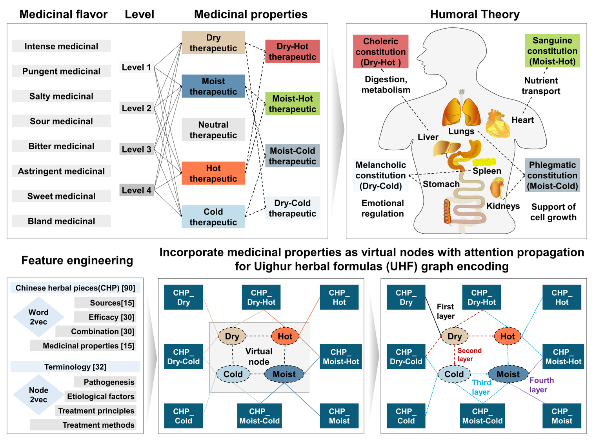

# 📘 Quantifying Compatibility Mechanisms in Uyghur Medicine with Interpretable Graph Neural Networks

This project implements a graph-based learning framework to model and interpret compatibility mechanisms in Uyghur traditional medicine prescriptions using **Graph Attention Networks (GATs)**. The system encodes herbal prescriptions into graphs, performs multi-layer attention-based reasoning, and visualizes influence pathways between herbal components.

---

  

---

## 🧠 Overview

- Herbal prescriptions are transformed into **heterogeneous graphs** with both actual and virtual nodes.
- A **4-layer GAT model** is used to extract node-level and graph-level features.
- Multi-head attention weights are traced and aggregated across layers to interpret the influence of herbs.
- Results are visualized via **heatmaps** and exported in structured `.tsv` format for further biomedical interpretation.

---

## 📁 Project Structure

| Folder          | Contents |
|-----------------|----------|
| `Python/`       | Jupyter Notebooks for graph construction, model inference, and compatibility quantification. |
| `Data/`         | Input datasets, encoded features, trained model, prediction outputs, and attention scores. |
| `Figure/`       | Heatmaps and graphical abstract for publication and visual analysis. |

---

## 🔄 Workflow Summary

1. **Graph Construction** (`1_Graph Embedding in UHF.ipynb`):
   - Generates graph representations of Uyghur prescriptions.

2. **Prediction with GAT** (`2_Prediction Using the GAT Model.ipynb`):
   - Runs multi-label classification and extracts attention weights.

3. **Quantitative Analysis** (`3_Quantitative of Compatibility Mechanisms Using the GAT Model.ipynb`):
   - Traces and aggregates multi-layer attention across paths for interpretability.

4. **Visualization**:
   - Outputs attention heatmaps for individual prescriptions (`Figure/`).

---

## 📌 Highlights

- Supports **multi-hop reasoning** through attention propagation.
- Provides **interpretable outputs** for domain experts (e.g., TCM compatibility analysis).
- Can be extended for other ethnomedicine or multi-component therapeutic modeling.

---

## 📬 Contact

**Jingqi Zeng**  
📧 Email: [zjingqi@163.com](mailto:zjingqi@163.com)

---

