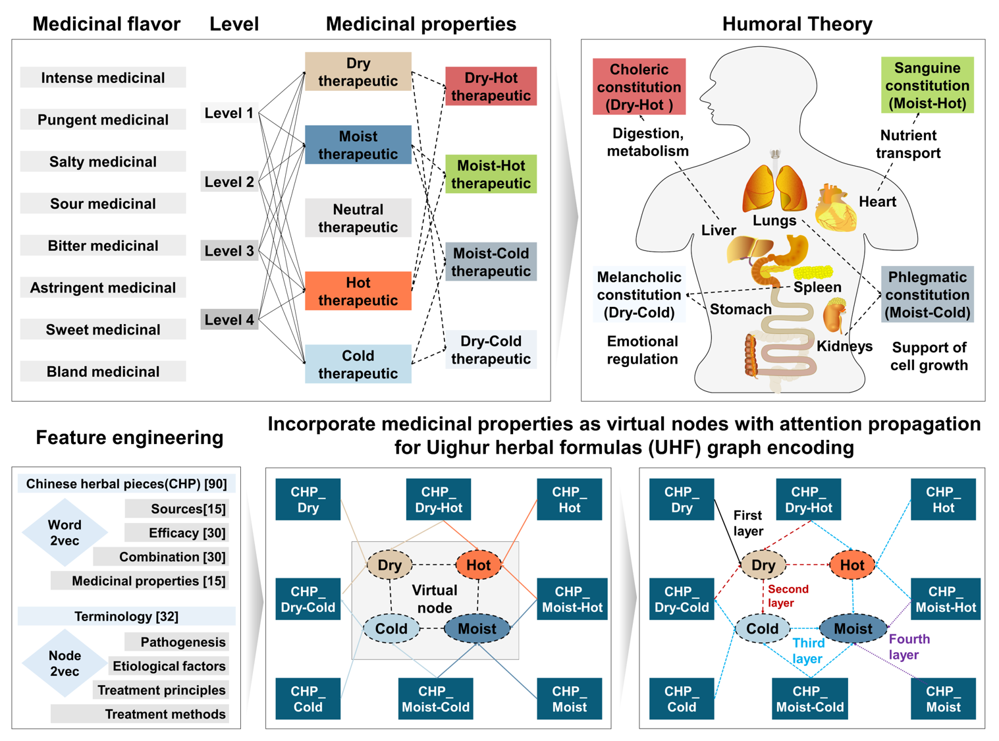

# GraphAI for Uyghur Medicine

This repository documents the current project version for graph-based modeling of Uyghur medicine prescriptions.

It contains the core notebooks, structured input tables, one previously trained GAT model, exported attention files, and example figures from the earlier completed project workflow. The purpose of this repository is to present the project clearly and preserve the working version that has already been run.

This repository currently focuses on:

- the original notebook workflow
- the existing trained model and exported artifacts already produced in the project
- project introduction, file organization, and reproducibility notes

It does not aim to present the later paper-upgrade experiments or any newly retrained version.



## Project Overview

- Graph construction from structured Uyghur medicine prescription tables
- Graph Attention Network inference for prescription-level prediction
- Multi-layer attention tracing for interpretable compatibility quantification
- Heatmap-based visualization of propagated herbal influence

## Repository Structure

```text
GraphAI-for-Uyghur-Medicine/
+-- Data/
|   +-- Test_input.xlsx
|   +-- Uighur_herbal_formulas.tsv
|   +-- Uighur_herbal_pieces.tsv
|   +-- UHF_UHP.tsv
|   +-- UHF_TCMT.tsv
|   +-- UHP_Encoder.tsv
|   +-- all_graphs_to_be_predicted.pt
|   +-- gat_model.pth
|   +-- prediction_outputs.tsv
|   +-- attention_weights.tsv
|   +-- attention_averages.tsv
|   `-- calculated_attention_weights.tsv
+-- Figure/
+-- Python/
+-- requirements.txt
+-- requirements-minimal.txt
`-- README.md
```

Directory notes:

- [Data/README.md](./Data/README.md)
- [Python/README.md](./Python/README.md)
- [Figure/README.md](./Figure/README.md)
- [PROJECT_SCOPE.md](./PROJECT_SCOPE.md)
- [REPRODUCIBILITY.md](./REPRODUCIBILITY.md)

## Workflow

1. Run `Python/1_Graph Embedding in UHF.ipynb`
   This builds graph objects from the structured input table and writes `Data/all_graphs_to_be_predicted.pt`.

2. Run `Python/2_Prediction Using the GAT Model.ipynb`
   This loads graph tensors, applies the GAT model, and exports:
   - `Data/gat_model.pth`
   - `Data/prediction_outputs.tsv`
   - `Data/attention_weights.tsv`

3. Run `Python/3_Quantitative of Compatibility Mechanisms Using the GAT Model.ipynb`
   This computes averaged attention, propagates multi-layer attention paths, and writes:
   - `Data/attention_averages.tsv`
   - `Data/calculated_attention_weights.tsv`
   - heatmap PDFs in `Figure/`

## Current Repository Scope

- `Data/gat_model.pth` is the previously generated model artifact kept with this project version.
- `Data/all_graphs_to_be_predicted.pt` and `Data/gat_model.pth` are committed repository artifacts for reproducing the current stored version.
- `Data/prediction_outputs.tsv`, `Data/attention_weights.tsv`, `Data/attention_averages.tsv`, and `Data/calculated_attention_weights.tsv` are existing exported outputs from the earlier completed workflow.
- The repository currently serves as a stable project snapshot rather than a benchmark-report repository.

For a more explicit boundary statement, see [PROJECT_SCOPE.md](./PROJECT_SCOPE.md).
For reproduction notes, see [REPRODUCIBILITY.md](./REPRODUCIBILITY.md).

## Environment

Two dependency files are included:

- `requirements.txt`
  Full local environment snapshot including Jupyter and notebook tooling

- `requirements-minimal.txt`
  Minimal dependency set for running the core notebooks

Recommended runtime:

- Python 3.10+
- PyTorch 2.7.x
- Torch Geometric 2.6.x
- CPU or GPU with matching PyTorch build

Example setup:

```powershell
python -m venv .venv
.venv\Scripts\Activate.ps1
python -m pip install --upgrade pip
pip install -r requirements-minimal.txt
```

## Key Files

Inputs:

- `Data/Test_input.xlsx`
- `Data/Uighur_herbal_formulas.tsv`
- `Data/Uighur_herbal_pieces.tsv`
- `Data/UHF_UHP.tsv`
- `Data/UHF_TCMT.tsv`
- `Data/UHP_Encoder.tsv`

Generated artifacts:

- `Data/all_graphs_to_be_predicted.pt`
- `Data/gat_model.pth`
- `Data/prediction_outputs.tsv`
- `Data/attention_weights.tsv`
- `Data/attention_averages.tsv`
- `Data/calculated_attention_weights.tsv`

## Reproducibility Notes

- Execute notebooks from within the `Python/` directory
- Preserve the relative path from `Python/` to `../Data`
- The repository currently favors direct reproducibility over packaging; it is not yet organized as a CLI tool or Python package

## Citation

If you reference the repository before the article title is finalized, cite the repository as software / project material. See [CITATION.cff](./CITATION.cff).

## Contact

Jingqi Zeng  
Email: `zjingqi@163.com`
